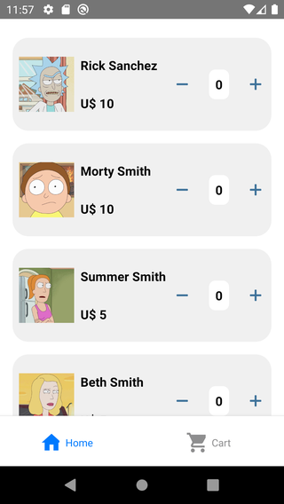

# Ricky and Morty marketplace

## Why?

This project is part of my personal portfolio, so, I'll be happy if you could provide me any feedback about the project, code, structure or anything that you can report that could make me a better developer!

Email-me: harrisonhenrisn@gmail.com

Connect with me at [LinkedIn](https://linkedin.com/in/harrison-henri-dos-santos-nascimento).

Also, you can use this Project as you wish, be for study, be for make improvements or earn money with it!

It's free!

## Functionalities

- Home screen



- Cart screen


## Install

Clone the repo using

```
$ git clone https://github.com/HarrisonHenri/rick-morty-react-native-shop
```

```
$ cd rick-morty-react-native-shop
```

Install all the required dependencies

```
$ yarn
```

Generate the schema typing

```
yarn gen-graphql
```


Then execute

```
$ yarn start
```

## Built With

- [React](https://github.com/facebook/react) - Build the web app using JavaScript and React
- [React-navigation](https://github.com/react-navigation/react-navigation) - Routing and navigation for your React Native apps
- [React-native](https://github.com/expo/react-native) - Build the native app using JavaScript and React
- [Apollo client](https://github.com/apollographql/apollo-client) - The graphql client
- [React-native vector icons](https://github.com/oblador/react-native-vector-icons) 
- [Graphql codegen](https://github.com/dotansimha/graphql-code-generator) - Graphql code generator
- [React-native testing library](https://github.com/callstack/react-native-testing-library) 

## Contributing

You can send how many PR's do you want, I'll be glad to analyse and accept them! And if you have any question about the project...

Email-me: harrisonhenrisn@gmail.com

Connect with me at [LinkedIn](https://linkedin.com/in/harrison-henri-dos-santos-nascimento-a6ba33112).

Thank you!
